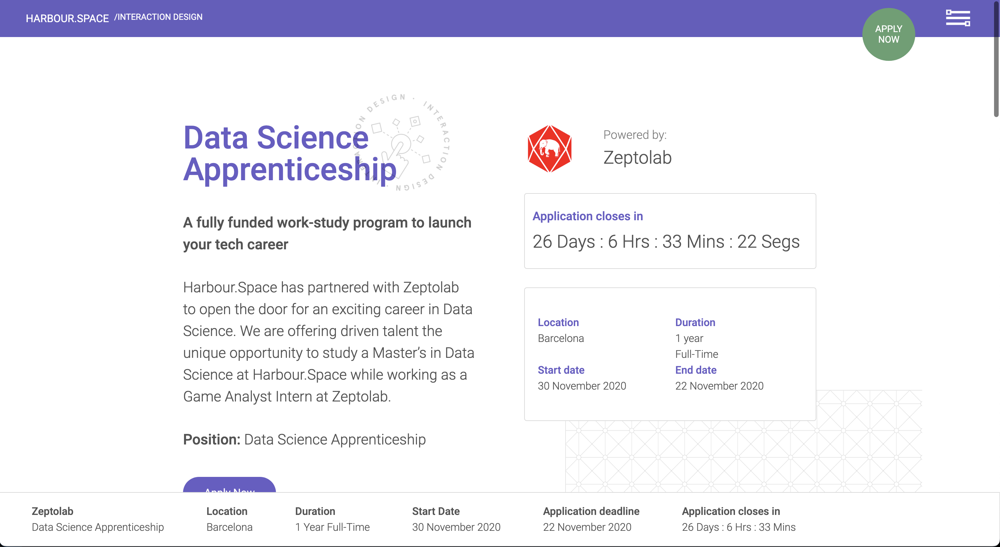

# Front-end Challenge Harbour.Space



## Getting Started

- Clone repository
  `git clone https://github.com/totisama/harbourspace-challenge`
- Run the following commands
  ```
  cd harbourspace-challenge
  npm install
  npm run dev
  ```
- Open [http://localhost:3000](http://localhost:3000) with your browser to see the result.

## Stack

- Next.js
- React
- Tailwind CSS
- Jest
- Vercel

## License

This project is licensed with the [MIT license](LICENSE).
